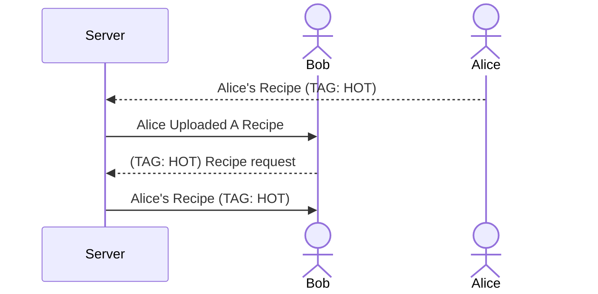

# Hungry?

[My Notes](notes.md)

> [!NOTE]
>  This is a template for your startup application. You must modify this `README.md` file for each phase of your development. You only need to fill in the section for each deliverable when that deliverable is submitted in Canvas. Without completing the section for a deliverable, the TA will not know what to look for when grading your submission. Feel free to add additional information to each deliverable description, but make sure you at least have the list of rubric items and a description of what you did for each item.

## 🚀 Specification Deliverable

> [!NOTE]
>  Fill in this sections as the submission artifact for this deliverable. You can refer to this [example](https://github.com/webprogramming260/startup-example/blob/main/README.md) for inspiration.

For this deliverable I did the following. I checked the box `[x]` and added a description for things I completed.

- [x] Proper use of Markdown
- [ ] A concise and compelling elevator pitch
- [x] Description of key features
- [x] Description of how you will use each technology
- [ ] One or more rough sketches of your application. Images must be embedded in this file using Markdown image references.

### Elevator Pitch
Sometimes someone may not know what have for a meal, and they just need some ideas. The Hungry? web application helps with this by allowing people to upload recipes and classify them. Then, they can go through and randomly see recipes of a certain criteria to get some ideas on what to make. If they don't want to see recipes, they can simply see a random type of food. The principle is to help people get some ideas flowing and provide some starting points. People can see as other post recipes to notice what may be popular or to provide more information and ideas.

### Design

This diagram shows how users will interact with the application and server to deposit and retrieve recipes.

### Key features

- Users can upload recipes to a server and attach simple word tag(s) that describe it.
- Users can select a tag. The app will randomly retrieve a recipe with that tag and provide it to the user.
- The user can then move to another recipe if they do not like the current one. The app will randomly cycle through recipes.
- Provides users with the weather for reference and/or can provide a random food name for brainstorming.
- Users will be notified every time someone uploads a recipe.

### Technologies

I am going to use the required technologies in the following ways.
- **HTML** - Several HTML screens, one for entering a recipe/login and one for retrieving and viewing recipes and foods. An options display allows the user to choose between the two.
- **CSS** - Simple styling that provides easy viewing. Allows for good recipe formatting on different screen sizing.
- **React** - Provides options display (upload/view recipes) and routes the user to the recipe/login page and the view recipe page. Shows recipes or foods according to user requests. In recipe upload view, provides login/User ID.
- **Service** - The application's backend will have endpoints for:
    - Retrieving and depositing recipe data, such as text and tags
    - Login information (user ID)
    - Call to API for weather data and/or random foods
- **DB/Login** - The app's database will store user ID, recipes, and tags (all associated with each other). This will allow the app to find recipes associated with certain tags and show them to the user.
- **WebSocket** - The app will provide small notifications whenever someone has uploaded a recipe. It may notify the user that someone has uploaded a reciped with a tag.

## 🚀 AWS deliverable

For this deliverable I did the following. I checked the box `[x]` and added a description for things I completed.

- [ ] **Server deployed and accessible with custom domain name** - [My server link](https://yourdomainnamehere.click).

## 🚀 HTML deliverable

For this deliverable I did the following. I checked the box `[x]` and added a description for things I completed.

- [ ] **HTML pages** - I did not complete this part of the deliverable.
- [ ] **Proper HTML element usage** - I did not complete this part of the deliverable.
- [ ] **Links** - I did not complete this part of the deliverable.
- [ ] **Text** - I did not complete this part of the deliverable.
- [ ] **3rd party API placeholder** - I did not complete this part of the deliverable.
- [ ] **Images** - I did not complete this part of the deliverable.
- [ ] **Login placeholder** - I did not complete this part of the deliverable.
- [ ] **DB data placeholder** - I did not complete this part of the deliverable.
- [ ] **WebSocket placeholder** - I did not complete this part of the deliverable.

## 🚀 CSS deliverable

For this deliverable I did the following. I checked the box `[x]` and added a description for things I completed.

- [ ] **Header, footer, and main content body** - I did not complete this part of the deliverable.
- [ ] **Navigation elements** - I did not complete this part of the deliverable.
- [ ] **Responsive to window resizing** - I did not complete this part of the deliverable.
- [ ] **Application elements** - I did not complete this part of the deliverable.
- [ ] **Application text content** - I did not complete this part of the deliverable.
- [ ] **Application images** - I did not complete this part of the deliverable.

## 🚀 React part 1: Routing deliverable

For this deliverable I did the following. I checked the box `[x]` and added a description for things I completed.

- [ ] **Bundled using Vite** - I did not complete this part of the deliverable.
- [ ] **Components** - I did not complete this part of the deliverable.
- [ ] **Router** - I did not complete this part of the deliverable.

## 🚀 React part 2: Reactivity deliverable

For this deliverable I did the following. I checked the box `[x]` and added a description for things I completed.

- [ ] **All functionality implemented or mocked out** - I did not complete this part of the deliverable.
- [ ] **Hooks** - I did not complete this part of the deliverable.

## 🚀 Service deliverable

For this deliverable I did the following. I checked the box `[x]` and added a description for things I completed.

- [ ] **Node.js/Express HTTP service** - I did not complete this part of the deliverable.
- [ ] **Static middleware for frontend** - I did not complete this part of the deliverable.
- [ ] **Calls to third party endpoints** - I did not complete this part of the deliverable.
- [ ] **Backend service endpoints** - I did not complete this part of the deliverable.
- [ ] **Frontend calls service endpoints** - I did not complete this part of the deliverable.
- [ ] **Supports registration, login, logout, and restricted endpoint** - I did not complete this part of the deliverable.

## 🚀 DB deliverable

For this deliverable I did the following. I checked the box `[x]` and added a description for things I completed.

- [ ] **Stores data in MongoDB** - I did not complete this part of the deliverable.
- [ ] **Stores credentials in MongoDB** - I did not complete this part of the deliverable.

## 🚀 WebSocket deliverable

For this deliverable I did the following. I checked the box `[x]` and added a description for things I completed.

- [ ] **Backend listens for WebSocket connection** - I did not complete this part of the deliverable.
- [ ] **Frontend makes WebSocket connection** - I did not complete this part of the deliverable.
- [ ] **Data sent over WebSocket connection** - I did not complete this part of the deliverable.
- [ ] **WebSocket data displayed** - I did not complete this part of the deliverable.
- [ ] **Application is fully functional** - I did not complete this part of the deliverable.
