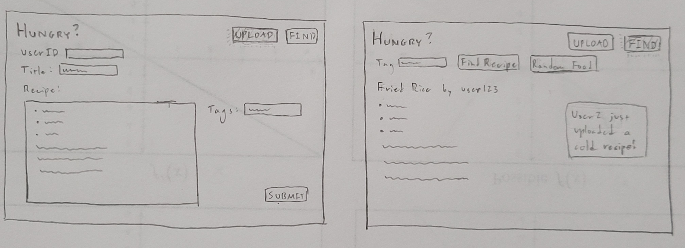
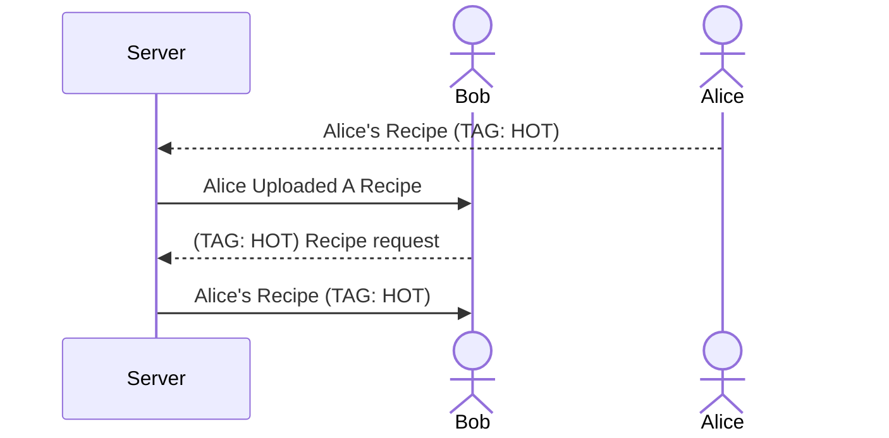

# Hungry?

[My Notes](notes.md)

> [!NOTE]
>  This is a template for your startup application. You must modify this `README.md` file for each phase of your development. You only need to fill in the section for each deliverable when that deliverable is submitted in Canvas. Without completing the section for a deliverable, the TA will not know what to look for when grading your submission. Feel free to add additional information to each deliverable description, but make sure you at least have the list of rubric items and a description of what you did for each item.

## 🚀 Specification Deliverable

> [!NOTE]
>  Fill in this sections as the submission artifact for this deliverable. You can refer to this [example](https://github.com/webprogramming260/startup-example/blob/main/README.md) for inspiration.

For this deliverable I did the following. I checked the box `[x]` and added a description for things I completed.

- [x] Proper use of Markdown - Used markdown for embedding images, lists, and diagrams
- [x] A concise and compelling elevator pitch - a simple description of how users would use the service and how it would benefit them
- [x] Description of key features - the basic features of how users would iteract with the service and how it would operate
- [x] Description of how you will use each technology - Basic information on how each technology will handle their respective features.
- [x] One or more rough sketches of your application. Images must be embedded in this file using Markdown image references. - simple sketch of what the pages look like to provide context.

### Elevator Pitch
Sometimes, someone may not know what have for a meal, and they just need some ideas. The "Hungry?" web application helps with this by providing random recipes and meal ideas. Users can upload recipes and attach tag(s) that help describe them, like "hot" or "spicy." Then, users can select a criteria and press a button to get a random recipe. If they don't want to see recipes, they can simply see a random type of food. The principle is to help people get some ideas flowing and provide some starting points for their cooking. People can see what and when others post to help them notice what may be popular or to just provide more ideas.

### Design
Basic concept design. The fundamentals are not complicated.

This diagram shows how users will interact with the application and server to deposit and retrieve recipes.

### Key features

- Users can type up a recipe in a text box to be uploaded to the server.
- Users can select a tag to be connected to the recipe. 
- Users can ask for a random recipe with a certain tag, and the app will randomly retrieve a recipe with that tag and provide it.
- The user can then move to another recipe if they do not like the current one. The app will randomly cycle through recipes.
- Provides users with the weather for reference and/or can provide a random foods for brainstorming.
- Users will be notified every time someone uploads a recipe.

### Technologies

I am going to use the required technologies in the following ways.
- **HTML** - Several HTML screens, one for entering a recipe/login and one for retrieving and viewing recipes and foods.
- **CSS** - Simple styling and aesthetic color pallette that provides easy viewing. Allows for good recipe formatting on different screen sizing. Some basic animations for interacting with buttons.
- **React** - Provides options display (upload/view recipes) and routes the user to the recipe/login page and the view recipe page depending on their input. Shows new recipes or foods according to user requests. In recipe upload view, provides login/User ID. Also controls the on-screen notifications.
- **Service** - The application's backend will have endpoints for:
    - Retrieving and depositing recipe data, such as text and tags; specifically, retrieving data that are connected to each other (recipes with a specific tag, etc).
    - Deposit login information/user ID in connection with recipe data
    - Call to API for weather data and/or random foods.
- **DB/Login** - The app's database will store user ID, recipe text, and tags (all associated with each other). This will allow the app to find recipes associated with certain tags and pull them from the database.
- **WebSocket** - The app will provide small notifications whenever someone has uploaded a recipe. It may notify the user that someone has uploaded a reciped with a tag.

## 🚀 AWS deliverable

For this deliverable I did the following. I checked the box `[x]` and added a description for things I completed.

- [x] **Server deployed and accessible with custom domain name** - [My server link](https://yourdomainnamehere.click).

## 🚀 HTML deliverable

For this deliverable I did the following. I checked the box `[x]` and added a description for things I completed.

- [x] **HTML pages** - I created two html pages, index.html and find-recipe.html, both for a function of the application 
- [x] **Proper HTML element usage** - I set up each page with an HTML tag, a head and footer, a <nav> section, and a body section with main. Within main I put in various tags for input, text, buttons, etc.
- [x] **Links** - In the <nav> section of each html file, I added links to the other html files. There is also a link to the Github repository on each page.
- [x] **Text** - Added title text and descriptive text to provide the user with directions and information. I also provided some placeholder text for some things that would be provided by the server/user.
- [ ] **3rd party API placeholder** - I did not complete this part of the deliverable.
- [x] **Images** - Icons placed in the header that will be formatted with CSS later. Simple food/fall related images.
- [ ] **Login placeholder** - I did not complete this part of the deliverable.
- [ ] **DB data placeholder** - I did not complete this part of the deliverable.
- [ ] **WebSocket placeholder** - I did not complete this part of the deliverable.

## 🚀 CSS deliverable

For this deliverable I did the following. I checked the box `[x]` and added a description for things I completed.

- [ ] **Header, footer, and main content body** - I did not complete this part of the deliverable.
- [ ] **Navigation elements** - I did not complete this part of the deliverable.
- [ ] **Responsive to window resizing** - I did not complete this part of the deliverable.
- [ ] **Application elements** - I did not complete this part of the deliverable.
- [ ] **Application text content** - I did not complete this part of the deliverable.
- [ ] **Application images** - I did not complete this part of the deliverable.

## 🚀 React part 1: Routing deliverable

For this deliverable I did the following. I checked the box `[x]` and added a description for things I completed.

- [ ] **Bundled using Vite** - I did not complete this part of the deliverable.
- [ ] **Components** - I did not complete this part of the deliverable.
- [ ] **Router** - I did not complete this part of the deliverable.

## 🚀 React part 2: Reactivity deliverable

For this deliverable I did the following. I checked the box `[x]` and added a description for things I completed.

- [ ] **All functionality implemented or mocked out** - I did not complete this part of the deliverable.
- [ ] **Hooks** - I did not complete this part of the deliverable.

## 🚀 Service deliverable

For this deliverable I did the following. I checked the box `[x]` and added a description for things I completed.

- [ ] **Node.js/Express HTTP service** - I did not complete this part of the deliverable.
- [ ] **Static middleware for frontend** - I did not complete this part of the deliverable.
- [ ] **Calls to third party endpoints** - I did not complete this part of the deliverable.
- [ ] **Backend service endpoints** - I did not complete this part of the deliverable.
- [ ] **Frontend calls service endpoints** - I did not complete this part of the deliverable.
- [ ] **Supports registration, login, logout, and restricted endpoint** - I did not complete this part of the deliverable.

## 🚀 DB deliverable

For this deliverable I did the following. I checked the box `[x]` and added a description for things I completed.

- [ ] **Stores data in MongoDB** - I did not complete this part of the deliverable.
- [ ] **Stores credentials in MongoDB** - I did not complete this part of the deliverable.

## 🚀 WebSocket deliverable

For this deliverable I did the following. I checked the box `[x]` and added a description for things I completed.

- [ ] **Backend listens for WebSocket connection** - I did not complete this part of the deliverable.
- [ ] **Frontend makes WebSocket connection** - I did not complete this part of the deliverable.
- [ ] **Data sent over WebSocket connection** - I did not complete this part of the deliverable.
- [ ] **WebSocket data displayed** - I did not complete this part of the deliverable.
- [ ] **Application is fully functional** - I did not complete this part of the deliverable.
