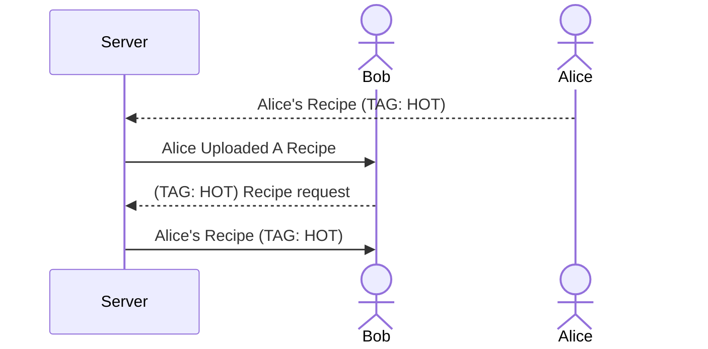

# Hungry?

[My Notes](notes.md)

> [!NOTE]
>  This is a template for your startup application. You must modify this `README.md` file for each phase of your development. You only need to fill in the section for each deliverable when that deliverable is submitted in Canvas. Without completing the section for a deliverable, the TA will not know what to look for when grading your submission. Feel free to add additional information to each deliverable description, but make sure you at least have the list of rubric items and a description of what you did for each item.

## 🚀 Specification Deliverable

> [!NOTE]
>  Fill in this sections as the submission artifact for this deliverable. You can refer to this [example](https://github.com/webprogramming260/startup-example/blob/main/README.md) for inspiration.

For this deliverable I did the following. I checked the box `[x]` and added a description for things I completed.

- [x] Proper use of Markdown - Used markdown for embedding images, lists, and diagrams
- [x] A concise and compelling elevator pitch - a simple description of how users would use the service and how it would benefit them
- [x] Description of key features - the basic features of how users would iteract with the service and how it would operate
- [x] Description of how you will use each technology - Basic information on how each technology will handle their respective features.
- [x] One or more rough sketches of your application. Images must be embedded in this file using Markdown image references. - simple sketch of what the pages look like to provide context.

### Elevator Pitch
Sometimes, someone may not know what have for a meal, and they just need some ideas. The "Hungry?" web application helps with this by providing random recipes and meal ideas. Users can upload recipes and attach tag(s) that help describe them, like "hot" or "spicy." Then, users can select a criteria and press a button to get a random recipe. If they don't want to see recipes, they can simply see a random type of food. The principle is to help people get some ideas flowing and provide some starting points for their cooking. People can see what and when others post to help them notice what may be popular or to just provide more ideas.

### Design
Basic concept design. The fundamentals are not complicated.


This diagram shows how users will interact with the application and server to deposit and retrieve recipes.



### Key features

- Users can type up a recipe in a text box to be uploaded to the server.
- Users can select a tag to be connected to the recipe. 
- Users can ask for a random recipe with a certain tag, and the app will randomly retrieve a recipe with that tag and provide it.
- The user can then move to another recipe if they do not like the current one. The app will randomly cycle through recipes.
- Provides users with the weather for reference and/or can provide a random foods for brainstorming.
- Users will be notified every time someone uploads a recipe.

### Technologies

I am going to use the required technologies in the following ways.
- **HTML** - Several HTML screens, one for entering a recipe/login and one for retrieving and viewing recipes and foods.
- **CSS** - Simple styling and aesthetic color pallette that provides easy viewing. Allows for good recipe formatting on different screen sizing. Some basic animations for interacting with buttons.
- **React** - Provides options display (upload/view recipes) and routes the user to the recipe/login page and the view recipe page depending on their input. Shows new recipes or foods according to user requests. In recipe upload view, provides login/User ID. Also controls the on-screen notifications.
- **Service** - The application's backend will have endpoints for:
    - Retrieving and depositing recipe data, such as text and tags; specifically, retrieving data that are connected to each other (recipes with a specific tag, etc).
    - Deposit login information/user ID in connection with recipe data
    - Call to API for weather data and/or random foods.
- **DB/Login** - The app's database will store user ID, recipe text, and tags (all associated with each other). This will allow the app to find recipes associated with certain tags and pull them from the database.
- **WebSocket** - The app will provide small notifications whenever someone has uploaded a recipe. It may notify the user that someone has uploaded a reciped with a tag.

## 🚀 AWS deliverable

For this deliverable I did the following. I checked the box `[x]` and added a description for things I completed.

- [x] **Server deployed and accessible with custom domain name** - [My server link](https://yourdomainnamehere.click).

## 🚀 HTML deliverable

For this deliverable I did the following. I checked the box `[x]` and added a description for things I completed.

- [x] **HTML pages** - I created two html pages, index.html and find-recipe.html, both for a function of the application 
- [x] **Proper HTML element usage** - I set up each page with an HTML tag, a head and footer, a ```<nav>``` section, and a body section with main. Within main I put in various tags for input, text, buttons, etc.
- [x] **Links** - In the ```<nav>``` section of each html file, I added links to the other html files. There is also a link to the Github repository on each page.
- [x] **Text** - Added title text and descriptive text to provide the user with directions and information. I also provided some placeholder text for some things that would be provided by the server/user.
- [x] **3rd party API placeholder** - An example of a random food was shown in find-recipe.html. When fully implemented, the application will retrieve a random food name from an API and display it here to the user INSTEAD OF a recipe. Both the recipe and the random food are shown for demonstration purposes.
- [x] **Images** - Icons placed in the header that will be formatted with CSS later. Simple food/fall related images.
- [x] **Login placeholder** - ID and password fields in index.html (as an account is only needed to upload recipes, not view them). Buttons to create a User ID or submit one. Placeholder text shows that the application will tell the user welcome to ensure them that they are logged in.
- [x] **DB data placeholder** - The Recipe text in find-recipe.html and the login notifier with the username are both placeholder texts for information that will be retrieved from the database. The tags would also be stored in the database and associated with specific recipes, so those would be shown alongside the retrieved recipes.
- [x] **WebSocket placeholder** - The placeholder text in find-recipe.html which reads "User2 just uploaded a COLD recipe!" is a WebSocket component, where it will be a real time notification whenever someone uploads a recipe.

## 🚀 CSS deliverable

For this deliverable I did the following. I checked the box `[x]` and added a description for things I completed.

- [x] **Header, footer, and main content body** - Created a header with an image, two rows of text, and two buttons with links. There is a footer of the same color with a button leading to the github page. There is content in the main part of each webpage, containing recipe text, input fields, and and buttons. The main content body is able to grow while the header/footer stay consistent. Flexbox and bootstrap were used to style the header, footer, and main content body.
- [x] **Navigation elements** - Each page had a header with two link buttons, each leading to one of the webpages of the application. There is a github link in the footer. The link buttons are formatted with bootstrap and some custom styling.
- [x] **Responsive to window resizing** - Each page is built with flexbox, so window resizing is fairly well handled. I added media elements in the CSS to hide the headers and footers at a certain size. When the application is resized, there is empty space at the bottom, allowing for a greater text box/recipe output. Several elements, such as the user-alert paragraphs and #header-bar nav, are set to fill any available space. The body element of each page will expand to fill available space.
- [x] **Application elements** - I used CSS to manipulate many of the HTML elements, including main, nav, header, footer, and some that I ID'd, such as find-input, user-alert, header-text, etc. I used a main.css file to create consistent format between shared elements on the html pages, and then separate css files (upload and find) for more specific and typically HTML main related styling. I altered many of the elements to include bootstrap functionality, such as the buttons, drop-down menus, and input boxes. Flexbox was used to format many of the elements and align them together.
- [x] **Application text content** - The text content is written in a sans-serif font. I formatted it mainly using flexbox. A body element and various other sub-elements use color attributes for the text. In the upload page, the text content consists of titles and input directions. There is example text of a successful and failed login. In the find page, the example text of the random food and recipe and the user-alert have been formatted using flexbox.
- [x] **Application images** - I formatted some small icons to be next to the title using flexbox. I also used bootstrap to format them to have rounded corners.

## 🚀 React part 1: Routing deliverable

For this deliverable I did the following. I checked the box `[x]` and added a description for things I completed.

- [x] **Bundled using Vite** - I installed vite using npm init and npm install. The git history shows the incremental changes to the project as I installed various components. I also installed various bootstrap and react components via the command line.
- [x] **Components** - Multiple components, including App, Upload, Find, and NotFound. App acts as the main body and includes the header and footer that stay constant. It is rendered by ```index.html```. Upload and Find contain body HTML for those specific functions, as well as a custom part of the header. App, Upload, and Find each have their respective css files, with ```app.css``` also acting as a overall css style for Upload and Find as well. NotFound is a component found in ```app.jsx``` that simply is to render a 404 error.
- [x] **Router** - Router components can be found within ```app.jsx```. The entire body section is wrapped in a ```<BrowserRouter>``` tag, and in the header ```<nav>``` tag there are NavLinks to several directories. Where the ```<main>``` tag would be there is the ```<Routes>``` tag, with three different routes. One is for ```/```, which directs to the Upload component, one is for ```/find```, which directs to Find component, and the other is for any other path, which directs to the NotFound component for a 404.

## 🚀 React part 2: Reactivity deliverable

For this deliverable I did the following. I checked the box `[x]` and added a description for things I completed.

- [x] **All functionality implemented or mocked out**
    - The login credentials are implemented and mocked out by allowing a user to enter in credentials and click submit or create. The application uses local storage as a mock server. It stores the credentials there when created and authenticates the user; if credentials are submitted instead of created, it checks them against the local storage already existing to verify them. It provides a notification depending on the authentication status to alert the user if they have been authenticated or not. A function is used to send the data to local storage.
    - Recipe submission is implemented/mocked out. It uses function sendRecipeData that is called on the recipeData form when the submit button is clicked. sendRecipeData checks if the user is authenticated; if they are, then it gets the form data, reads it to a FormData object, which then maps the form data to the "server" (local storage). This form data includes the recipe title, recipe text, and the tag.
    - The Find Recipe functionality has been implemented/mocked out. When this button is clicked, the application reads the data in the "server" and checks it against the tag selected (due to the limitations of localStorage, we are only able to have one recipe set; however, this is just the mockup, and server implmentation will allow us to instead check for a random recipe of the tag type). It then displays the recipe, which is associated with that tag type selected.
    - The Random Food functionality is implemented/mocked out. When this button is clicked, it pulls a random value from an array containing various food names. This array represents an API, and the random call represents a random call to the API. This random "API call" is then displayed.
    - The user notification/websocket functionality is implemented/mocked out. It uses a useEffect to listen for changes in state variables from a setInterval representing a server data being pushed over a Websocket. State change functions are used to take the user and food tag data coming from the "server" and change the states, which are displayed as the data comes in; the setInterval updates every 10 seconds to represent the server data being pushed.
- [x] **Hooks** -
    In upload.jsx, there is 1 useState hook with the userAuth state and updateUserAuth state update function.
    - userAuth contains a default value of null and then is a boolean. It is updated by verifyID run by SubmitID, which is run when "Submit ID" is clicked (it changes to true when login credentials match those existing in the "server data") or in CreateID (when a user creates a new ID by clicking "Create ID"). It is used to verify that a user has logged in, allowing recipe data to be sent to the server (localStorage) and to display a login confirmation (true), a login rejection (false), or be blank (null).

    In find.jsx, there are 5 useState hooks and one useEffect hook. clickRecipe, clickFood, username, tag, and show are the states associated with the 5 useStates.
    - clickRecipe contains text to be displayed when "Find Recipe" is clicked. When this button is clicked, it changes the state of clickRecipe to be the recipeText associated with the selected tag.
    - clickFood contains a random food. When "Random Food" is clicked, it updates clickFood to a random food.
    - username contains a random number representing a userID that is displayed in the green notification on the right. It is updated by the mock server pull.
    - tag contains a tag value, found in the tags array. It is displayed in the notification on the right as well. It is updated by the mock server pull. Together, username and tag represent server/websocket data being displayed in realtime.
    - show contains a boolean. Depending on the value of the boolean, either DisplayRecipe or DisplayFood is displayed or blank. show is updated by clicking on "Random Food" or "Find Recipe", which will update it to the correct value to allow their corresponding displays to display.
    - useEffect hook: This useEffect hook contains an arrow function with an interval, which runs every 10 seconds. Every 10 seconds, it updates username and tag via their state change functions. When username updates, it triggers the useEffect again. The hook is listening to the setInterval, which is simulating a server pull, and acts as a way to update these states according to this server pull.

    There are various functions that assist with this functionality, including functions dedicated for sending and receiving the data (for example, getRecipe, sendRecipeData, sendLoginData, etc.), displaying the data (these are the actual components that are rendered, such as DisplayAuthMessage and DisplayFood), and for debugging (printLocalStorage).

    To see a full test, enter a user ID and a password and click "Create ID". Note that if you try to sign in with another password, you will be unable too, and if you have a failed login, the recipe data will not be submitted to localstorage even if you hit submit and it clears (see the console). 

    After you have signed in (a green box should show), enter a Recipe Title and some Recipe text, and select a recipe tag. REMEMBER THE TAG YOU SELECT. Hit submit. The fields should clear.

    Then, go to the Find Recipes page. You will see a default recipe. If you click "Random Food", then the recipe will disappear and a random food will appear.

    Select the tag that you had submitted earlier. If you click "Random Food" then your recipe from before should show up.

    You'll notice notifications on the right.


## 🚀 Service deliverable

For this deliverable I did the following. I checked the box `[x]` and added a description for things I completed.

- [x] **Node.js/Express HTTP service** - Used express in service/index.js to set up the express HTTP service.
- [x] **Static middleware for frontend** - set up ```app.use(express.static('public'))```. Not really a need to serve up anything from public.
- [x] **Calls to third party endpoints** - Call to the ```/api/v1/reports/?category=Running%20On%20Empty``` and ```/api/v1/reports/?category=Drink%20Review``` endpoints of the Report of the Week API to get food data that would be sent to the frontend.
- [x] **Backend service endpoints** - Wrote endpoints for accessing an external API (get /randomFood), getting a random recipe from the database according to a tag (get /RandomRecipe/:id called from ClickRecipe), and pushing a random recipe to the database (post /sendRecipe called from sendRecipeData). There are also service endpoints for creating a userID, logging in, logging out, and getting user information (this one was unused).
- [x] **Frontend calls service endpoints** - The frontend element for Random Food makes a call to the Review of the Week API. Due to CORS issues, instead of doing a call directly from frontend to the API, I instead had frontend make an API call to the backend, which then handled the API call. In find.jsx, the frontend element of ClickRecipe (Find Recipe), when clicked, calls getRecipe, which makes a service endpoint call at GET /getRandomRecipe/:id. In upload.jsx, the components responsible for creating an ID, submitting an ID, logging out, and sending a recipe to the database call service endpoints on the backend corresponding with their functionality. All these calls use fetch.
- [x] **Supports registration, login, logout, and restricted endpoint** - This was completed. Registration, login, and logout functionality exists and use cookies. Recipes cannot be sent without being logged in through authentication, thus restricting the /sendRecipe endpoint.

## 🚀 DB deliverable

For this deliverable I did the following. I checked the box `[x]` and added a description for things I completed.

- [x] **Stores data in MongoDB** - Done. In ```database.js```, I added the addRecipe function that will take a recipe and, according to the recipe tag, place it in a MongoDB collection associated with that tag. This function was then called at the POST /sendRecipe endpoint. I also wrote the getRecipe function that will select a random recipe from a collection according to the selected tag. This is called by the GET /getRandomRecipe/:id endpoint, which then sends the result to the frontend.
- [ ] **Stores credentials in MongoDB** - I did not complete this part of the deliverable.

## 🚀 WebSocket deliverable

For this deliverable I did the following. I checked the box `[x]` and added a description for things I completed.

- [ ] **Backend listens for WebSocket connection** - I did not complete this part of the deliverable.
- [ ] **Frontend makes WebSocket connection** - I did not complete this part of the deliverable.
- [ ] **Data sent over WebSocket connection** - I did not complete this part of the deliverable.
- [ ] **WebSocket data displayed** - I did not complete this part of the deliverable.
- [ ] **Application is fully functional** - I did not complete this part of the deliverable.
